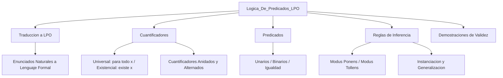

# Lógica de Predicados — Estrategias de Formalización

> Estrategias de formalización para la Lógica de Predicados de Primer Orden (LPO): traducción, cuantificadores e inferencia.

## Descripción

---

Proyecto de **Lógica Computacional** centrado en las estrategias de formalización de enunciados del lenguaje natural al lenguaje formal de la **Lógica de Predicados de Primer Orden (LPO)**. Se trabajan cuantificadores universales y existenciales, predicados unarios/binarios, instanciación universal/existencial y demostración de validez de fórmulas.

## Temas cubiertos

| Tema | Descripción |
|---|---|
| Traducción a LPO | Formalización de enunciados naturales con cuantificadores |
| Cuantificadores | Universal (∀) y existencial (∃), anidados y alternados |
| Predicados | Unarios, binarios, de igualdad |
| Reglas de inferencia | Modus Ponens, Modus Tollens, instanciación, generalización |
| Demostraciones | Validez de argumentos por deducción natural |

## Arquitectura

## Contenido del repositorio

| Archivo | Descripción |
|---|---|
| `*.pdf` | Ejercicios resueltos de formalización en LPO |
| `*.docx` | Desarrollo del proyecto con fundamentos teóricos |

## Contexto académico

**Asignatura:** Lógica Computacional · **Institución:** Ingeniería Informática
**Autor:** Alejandro De Mendoza — Ingeniero Informático · Especialista en IA

---

## Autor

**Alejandro De Mendoza**  
Ingeniero Informático · Especialista en IA · Especialista en Ingeniería de Software · Máster en Arquitectura de Software

